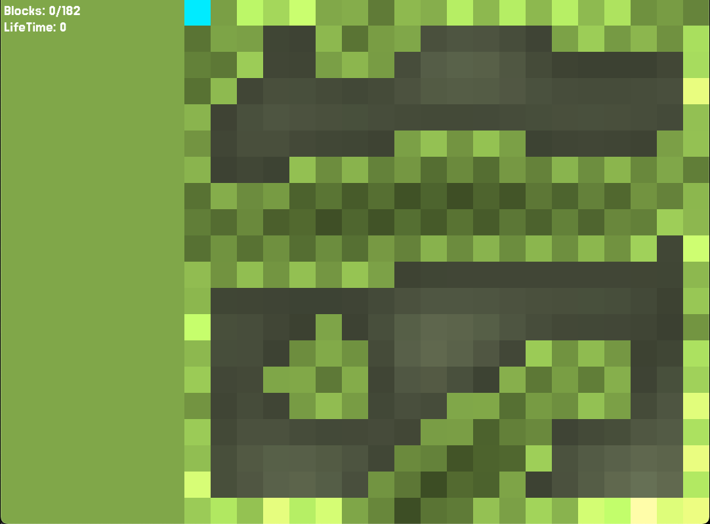

# Worm Washer

Worm Washer est un jeu au rythme rapide qui rappelle le Snake, mais avec une touche unique : votre objectif est de consommer tous les murs de la carte \! Naviguez stratégiquement pour vider chaque niveau.

## Démarrer

### Jouer

Worm Washer est prêt à être joué sur Windows et macOS. Vous pouvez télécharger l'exécutable directement depuis le dépôt GitHub, dans le dossier ./WormsWasher.

- Naviguez vers le dossier WormsWasher dans le dépôt.
- Téléchargez le fichier exécutable correspondant à votre système d'exploitation (par exemple, WormsWasher.exe pour Windows ou WormsWasher pour macOS).
- Lancez le jeu !

### Compiler depuis les sources

Si vous souhaitez compiler le jeu pour d'autres systèmes d'exploitation ou si vous préférez simplement le compiler vous-même, vous aurez besoin de **Go** installé sur votre système.

1.  **Installer Go :** Si ce n'est pas déjà fait, téléchargez et installez Go depuis le site officiel : [golang.org/dl/](https://golang.org/dl/)
2.  **Cloner le dépôt :**
    ```bash
    git clone https://github.com/RedginaldGodeau/WormsWasher
    cd WormsWasher
    ```
3.  **Compiler le jeu :**
    ```bash
    go build -o wormwasher
    ```
    Ceci créera un fichier exécutable nommé `WormsWasher` (ou `WormsWasher.exe` sur Windows) dans votre répertoire actuel.

## Technologies utilisées

Worm Washer est entièrement développé en **Go**.


